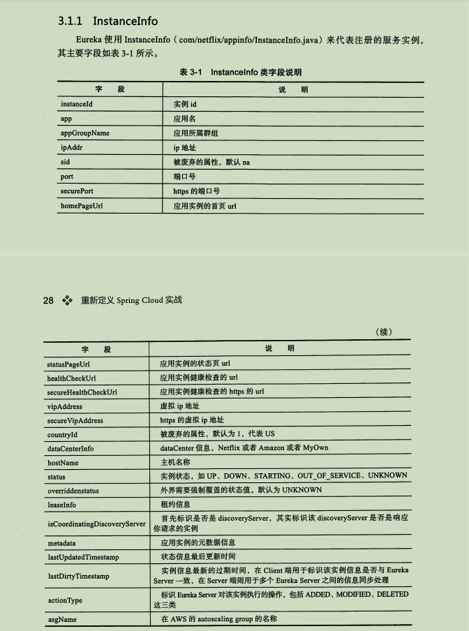
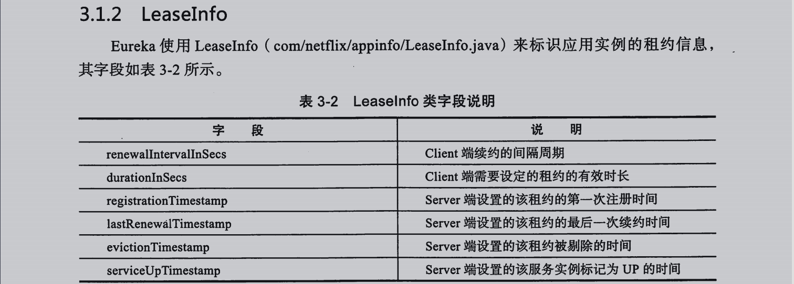
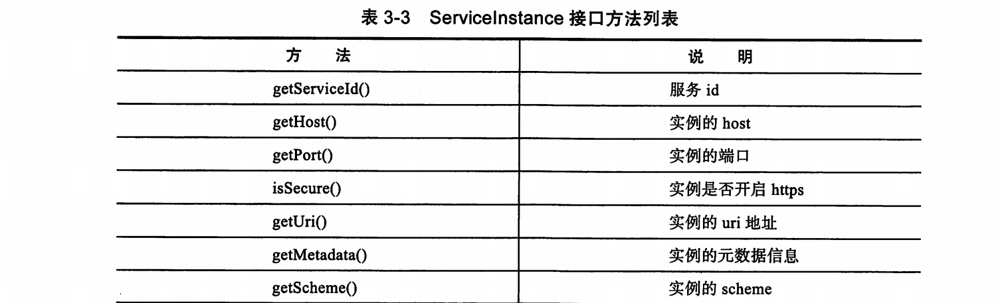
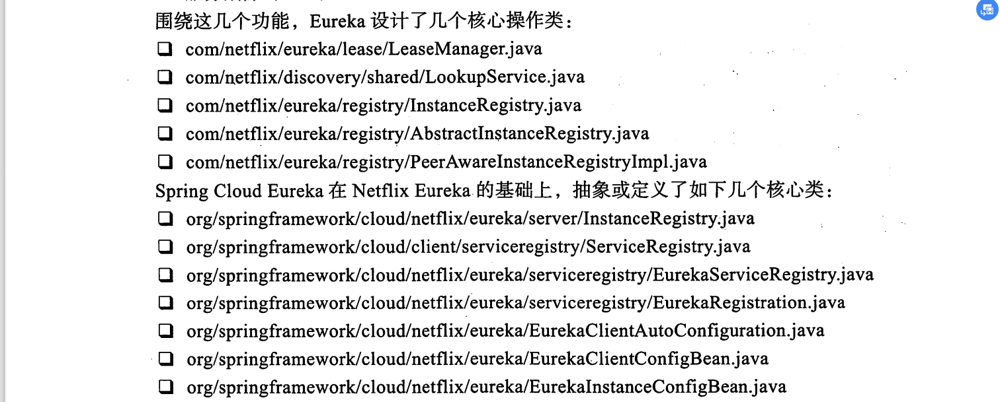

1.网关中间件的四大功能
    统一接入功能:为各种无线应用提供统一的接入服务，提供一个高性能，高并发，高可用的网关服务
    协议适配功能:当请求通过网关时，经过filter处理完，此时就需要进行协议适配，判断应该协议转发调用PRC服务，调用RET服务还是PHP提供的服务
    流量管控:网关作为所有请求流量的入口，当请求流量剧增，后端服务出现异常不可用时，网关支持负载均衡，容灾切换，使得不可用服务降级(在异地多活场景中根据流量进行分片，路由到不同的机房)
    安全防护功能:网关对所有请求进行安全防护过滤，保护后端服务

2.pom文件中的<parent>节点下的<relativePath/>代表父项目的pom.xml文件的相对路径。默认值为../pom.xml
    maven首先从当前构建项目开始查找父项目的pom文件，然后从本地仓库，最有从远程仓库。

3.
    <properties>
        <!-- 项目编译字符集编码 -->
        <project.build.sourceEncoding>UTF-8</project.build.sourceEncoding>
        <!-- 项目日志字符集编码 -->
        <project.reporting.outputEncoding>UTF-8</project.reporting.outputEncoding>
        <java.version>1.8</java.version>
        <spring-cloud.version>Finchley.RELEASE</spring-cloud.version>
    </properties>

4.eureka api:
    

5.eureka 的核心类
    
    
    
    InstanceStatus,用于标记服务实例的状态，其中OUT_OF_SERVICE,经常用于升级部署
    ,重点：LeaseManager和LookupService

6.Regin和Zone的设计
    资源在regin之间默认不会复制，因此eureka的高可用主要在于regin下面的zone
    一个zone可以设置多个eureka server实例，他们之间构成peer节点，采用peer to peer的复制模式；由于eureka client支持preferSameZone(eureka server集群条件下也可以看作是一个eureka client)，eureka server 的serviceUrl会优先拉去跟其自身实例同zone的eureka server的地址列表

